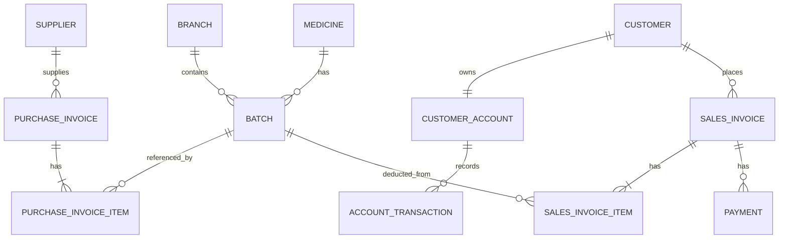

# 💊 نظام إدارة الصيدلية المتكامل المطور (Advanced Pharmacy Management System)

نظام برمجى متكامل وقوي مبني باستخدام إطار عمل **Laravel 11** وأحدث التقنيات البرمجية، مصمم خصيصاً لأتمتة وإدارة كافة العمليات اليومية في الصيدليات الفردية والشركات ذات الفروع المتعددة. يغطي النظام الدورة المستندية الكاملة من إدارة المخزون الذكية بالتشغيلات (Batches)، عمليات البيع الفوري ونقاط البيع (POS)، حسابات العملاء والديون والمدفوعات الآجلة، فواتير المشتريات وحسابات الموردين، وإدارة المرتجعات، بالإضافة إلى نظام تقارير ذكي يصدر تقارير مالية ومخزنية بصيغة PDF.

---

## 🚀 المميزات الرئيسية بالتفصيل الممل (Exhaustive Features)

### 📦 1. إدارة المخزون الذكية والتشغيلات (Smart Inventory & Batches)
* **تتبع التشغيلات (Batch-Based Tracking):** لا يعتمد النظام على الكمية الإجمالية فقط للدواء، بل يقسمها إلى تشغيلات فريدة (`Batches`). كل تشغيلة تسجل برقم مميز (`batch_number`)، وتاريخ إنتاج (`manufacture_date`)، وتاريخ انتهاء صلاحية (`expiry_date`)، وسعر شراء وسعر بيع خاصين بها. هذا يمنح الصيدلي تحكماً كاملاً بالدواء وتواريخ انتهاء الصلاحية.
* **تنبيهات انتهاء الصلاحية التلقائية:** نظام مراقبة ذكي يعرض في لوحة التحكم بشكل فوري وتفاعلي جميع التشغيلات القريبة من الانتهاء (خلال 90 يوماً القادمة) لمساعدة الصيدلي على تداركها وإرجاعها أو بيعها.
* **حد إعادة الطلب (Reorder Level):** يتم تحديد مستوى كمية أمان لكل دواء بشكل منفصل. بمجرد انخفاض مجموع كميات التشغيلات للدواء في الفرع عن هذا الحد، يظهر الدواء تلقائياً في قائمة "النواقص" بلوحة التحكم لتسهيل طلبها مجدداً.
* **تعدد وحدات البيع:** دعم مرن لبيع الأدوية بوحدات صرف مختلفة (شريط، علبة، زجاجة) مع التحكم التلقائي بالأسعار والكميات.
* **نظام الباركود (Barcode System):** تسجيل الرمز الشريطي (Barcode) لكل دواء لتسهيل عمليات البحث والبيع الفوري عبر أجهزة قارئ الباركود.

### 💰 2. نظام المبيعات ونقاط البيع المتطورة (Sales & POS System)
* **واجهة بيع تفاعلية سريعة (POS UI):** مصممة لتسهيل تسجيل الفواتير واختيار الفرع والعميل ونوع الدفع.
* **البيع من التشغيلات المتوفرة:** يقوم النظام تلقائياً بعرض التشغيلات المتوفرة والتي تحتوي على رصيد متاح فقط، ويقوم بخصم الكميات المباعة مباشرة من التشغيلة المحددة عند تأكيد الفاتورة.
* **المبيعات الآجلة وحسابات المديونية:** دعم كامل للعملاء الموثوقين؛ حيث يمكن إصدار فاتورة بحالة **"معلق"**، ليقوم النظام تلقائياً بترحيل قيمة الفاتورة كدين على حساب العميل وتعديل رصيده التراكمي في قاعدة البيانات مع التحقق من الحد الائتماني المسموح به للعميل (`credit_limit`).
* **طباعة الفواتير والإيصالات الحرارية:** 
  * **الفاتورة الرسمية (Print Invoice):** نموذج طباعة منسق ومنظم مقاس A4 يعرض تفاصيل الفاتورة والضرائب والخصومات.
  * **الإيصال الحراري (Receipt):** إيصال بيع سريع ومبسط مناسب للطابعات الحرارية المخصصة لنقاط البيع (POS).

### 👥 3. الحسابات المالية والعملاء (Financial & Customer Accounts)
* **ملفات العملاء المتقدمة:** تسجيل بيانات العملاء المالية والشخصية وتحديد الحد الائتماني التراكمي الأقصى.
* **حسابات العملاء المالية (`CustomerAccount`):** حساب مالي فريد لكل عميل يرصد المديونية الإجمالية المستحقة عليه للحسابات الآجلة.
* **سجل المعاملات المحاسبية (`AccountTransactions`):** نظام مالي دقيق يسجل العمليات كـ **مدين (Debit)** عند الشراء بآجل، و **دائن (Credit)** عند سداد مبالغ نقدية.
* **سندات القبض والمدفوعات (`Payments`):** شاشة مخصصة لتسجيل الدفعات النقدية الواردة من العملاء لتخفيض مديونياتهم، مع إمكانية طباعة سند قبض وتحديث رصيد الحساب المالي تلقائياً.

### 🚚 4. المشتريات وإدارة الموردين (Purchases & Suppliers)
* **تسجيل فواتير الشراء:** إدخال كميات الأدوية المشتراة من الشركات والموردين وتحديد أسعار الشراء وأسعار البيع وتواريخ الصلاحية الخاصة بكل صنف في الفاتورة.
* **التوليد التلقائي للتشغيلات:** عند تأكيد فاتورة المشتريات، يقوم النظام تلقائياً بإنشاء تشغيلات مخزنية جديدة في قاعدة البيانات وربطها بالدواء والفرع، مما يرفع رصيد المخزون مباشرة للبيع.
* **إدارة الموردين:** تتبع بيانات الموردين وشركات الأدوية وإجمالي المبالغ والتعاملات المالية معهم.

### 🔄 5. إدارة المرتجعات المحاسبية (Returns Management)
* **مرتجعات المبيعات (Sales Returns):** إمكانية إرجاع الفواتير المباعة أو بنود محددة منها، ليقوم النظام بإرجاع الكميات المرتجعة للتشغيلات الأصلية بالمخزون وخصم قيمتها تلقائياً من مديونية العميل (إذا كانت الفاتورة معلقة بالآجل).
* **مرتجعات المشتريات (Purchase Returns):** لإرجاع البضائع التالفة أو القريبة من الانتهاء للمورد، مع خصم كمياتها تلقائياً من تشغيلات المخزون المتأثرة لضمان سلامة الأرصدة الفعلية.

### 📊 6. لوحة التحكم والتقارير المالية والـ PDF (Dashboard & PDF Reports)
* **لوحة التحكم اللحظية (Live Dashboard):** شاشة تعرض إجمالي مبيعات اليوم الصافية، مشتريات اليوم الصافية، وإحصائيات سريعة للتحليلات الإدارية.
* **لوحة مراقبة المخاطر:** عرض فوري للأدوية التي وصلت لحد إعادة الطلب (النواقص)، والتشغيلات التي قاربت صلاحيتها على الانتهاء.
* **نظام التقارير والتصدير (Daily PDF Reports):** خدمة `ReportService` الذكية تجمع بيانات المبيعات والمشتريات والنواقص وحالة المخزون، وتقوم بتوليد تقارير مالية وتصديرها بصيغة PDF وتخزينها على السيرفر لتسهيل تحميلها والاحتفاظ بسجلات أرشيفية متكاملة.

---

## 🛠 التقنيات المستخدمة (Technical Stack)

| التقنية / المكتبة | الغرض والاستخدام |
| :--- | :--- |
| **Laravel 11** | إطار العمل الخلفي الأساسي (Backend Framework) مع هيكلية قوية وآمنة |
| **MySQL / MariaDB** | قاعدة البيانات العلائقية لتخزين البيانات المالية والتجارية والمخزنية بدقة |
| **Tailwind CSS** | بناء واجهات مستخدم مخصصة، عصرية وتجاوبية بالكامل (Responsive UI) |
| **Blade Templates** | محرك القوالب المدمج في لارافيل لبناء صفحات العرض |
| **Laravel Breeze** | نظام توثيق وصلاحيات آمن (Authentication & Authorization) |
| **Vite** | أداة تجميع وإدارة ملفات الفرونت إند بسرعة عالية وأداء مثالي |
| **DomPDF (`barryvdh/laravel-dompdf`)** | توليد وتصدير التقارير المالية والفواتير بصيغة PDF |

---

## 🏗 هيكل قاعدة البيانات بالتفصيل الممل (Database Schema & Relations)

يعتمد النظام على هيكلية قاعدة بيانات مترابطة ومنظمة لضمان تكامل البيانات المالية والمخزنية ومنع حدوث أي تعارضات:



### شرح تفصيلي للجداول البرمجية وقواعد العلاقات:

#### 1. جدول الأدوية (`medicines`)
يخزن البيانات الثابتة للأدوية المسجلة في النظام:
* `id` (int, Primary Key): المعرف الفريد.
* `name` (string): اسم الدواء العلمي أو التجاري.
* `category` (string): فئة وتصنيف الدواء (مثل: مضادات حيوية، مسكنات).
* `description` (text): وصف الدواء وطرق الاستخدام.
* `barcode` (string): الباركود الفريد للمنتج.
* `unit` (enum): وحدة الصرف المتاحة (`شريط`, `علبه`, `زجاجه`).
* `price` (integer): السعر الافتراضي للدواء.
* `reorder_level` (integer): الكمية الحرجة التي يتم التنبيه عندها لطلب الدواء.
* `is_active` (boolean): حالة نشاط الدواء في النظام.
* **العلاقات (Eloquent Relations):**
  * `hasMany(Batch::class)`: الدواء يحتوي على تشغيلات وكميات متعددة.

#### 2. جدول تشغيلات الأدوية المخزنية (`batches`)
الجدول المسؤول الفعلي عن تتبع مخزون الصيدلية مقسماً بحسب دفعات الشراء وتواريخ الصلاحية:
* `id` (int, Primary Key)
* `medicine_id` (foreign key ➔ `medicines`): الدواء المرتبط بالتشغيلة.
* `branch_id` (foreign key ➔ `branches`): الفرع المتواجد فيه المخزون.
* `batch_number` (string, Unique): رقم التشغيلة التعريفي الفريد.
* `manufacture_date` (date): تاريخ الإنتاج.
* `expiry_date` (date): تاريخ انتهاء الصلاحية.
* `quantity` (decimal, 8,2): الكمية المتوفرة حالياً في هذه التشغيلة للفرع المحدد.
* `purchase_price` (integer): سعر شراء الدواء للوحدة في هذه التشغيلة.
* `selling_price` (integer): سعر بيع الدواء المعتمد لهذه التشغيلة.
* **العلاقات (Eloquent Relations):**
  * `belongsTo(Medicine::class)`: تنتمي التشغيلة لدواء معين.
  - `belongsTo(Branch::class)`: تتواجد التشغيلة في فرع معين.

#### 3. جدول حسابات العملاء (`customer_accounts`)
يسجل البيانات المالية وحالة المديونيات الحالية لكل عميل:
* `id` (int, Primary Key)
* `customer_id` (foreign key ➔ `customers`): العميل مالك الحساب المالي.
* `balance` (decimal, 10,2): رصيد الدين الحالي التراكمي المستحق على العميل (يزداد بالبيع الآجل وينخفض بالسداد).
* **العلاقات (Eloquent Relations):**
  * `belongsTo(Customer::class)`: يرتبط بالعميل صاحب الحساب المالي.
  * `hasMany(AccountTransaction::class)`: يحتوي على سجل كامل بكافة حركات الديون والسداد التفصيلية.

#### 4. جدول المعاملات المالية للعملاء (`account_transactions`)
نظام القيد المحاسبي المزدوج لتتبع حركات الحساب:
* `id` (int, Primary Key)
* `customer_account_id` (foreign key ➔ `customer_accounts`): الحساب المالي التابع له الحركة.
* `transactionable_type` & `transactionable_id` (Polymorphic): لربط الحركة تلقائياً بمصدرها المالي (سواء كانت فاتورة مبيعات معلقة أو سند دفع وسداد).
* `type` (enum): نوع الحركة المحاسبية (`debit` مدين لزيادة المديونية، `credit` دائن لتخفيض المديونية بالدفع).
* `amount` (decimal, 10,2): قيمة الحركة المالية.

---

## 📂 هيكل المجلدات وشرح الملفات البرمجية بالتفصيل

لنسهل على المطورين فهم تدفق البيانات، إليك تفصيل المجلدات والملفات البرمجية الأساسية في التطبيق:

```
├── app/
│   ├── Http/
│   │   └── Controllers/
│   │       ├── BatchController.php     # إدارة مخزون التشغيلات والكميات وتواريخ الصلاحية
│   │       ├── BranchController.php    # إدارة فروع الصيدلية المتعددة وتعديلها
│   │       ├── CustomerController.php  # إدارة ملفات العملاء الجدد والحسابات الآجلة والحد الائتماني
│   │       ├── DashboardController.php # حساب وإظهار البيانات المالية اليومية والنواقص وتنبيهات الصلاحية
│   │       ├── MedicineController.php  # إدارة البيانات الأساسية والباركود للأدوية
│   │       ├── PaymentController.php   # معالجة وتوثيق سندات القبض والدفع لتخفيض مديونية العميل
│   │       ├── PurchaseInvoiceController.php # إدارة فواتير المشتريات، وتكوين التشغيلات تلقائياً بالمخزون
│   │       ├── PurchaseReturnController.php  # إدارة مرتجعات الشراء وتعديل كميات المخزون
│   │       ├── ReportController.php    # تصفح التقارير المالية وطلب إنشاء التقارير اليومية
│   │       ├── SalesInvoiceController.php    # إدارة المبيعات، الـ POS، خصم المخزون الذكي، وتسجيل ديون العملاء
│   │       ├── SalesReturnController.php     # إدارة مرتجعات المبيعات وإعادة الكميات للمخزون تلقائياً
│   │       └── SupplierController.php  # إدارة ملفات الموردين وشركات الأدوية المتعامل معها
│   ├── Models/                         # نماذج قواعد البيانات (Eloquent Models)
│   │   ├── Batch.php                   # نموذج التشغيلة وربطه بالأدوية والفروع
│   │   ├── Branch.php                  # نموذج الفرع والتحكم به
│   │   ├── Customer.php                # نموذج العميل وعلاقته بفواتير المبيعات
│   │   ├── CustomerAccount.php         # نموذج الحساب المالي للعميل ورصيد المديونية
│   │   ├── Medicine.php                # نموذج الدواء وتفاصيل حد إعادة الطلب
│   │   ├── Payment.php                 # نموذج السداد والتحصيلات
│   │   ├── PurchaseInvoice.php         # نموذج فاتورة الشراء الأساسية وإجمالي القيمة
│   │   ├── PurchaseInvoiceItem.php     # تفاصيل الأصناف المشتراة في كل فاتورة
│   │   ├── PurchaseReturn.php          # نموذج المرتجعات للموردين
│   │   ├── Report.php                  # نموذج السجلات اليومية للتقارير والملفات المخزنة
│   │   ├── SalesInvoice.php            # نموذج فاتورة البيع والـ POS وحالتها
│   │   ├── SalesInvoiceItem.php        # الأصناف المباعة المخصومة من تشغيلات المخزون
│   │   ├── Supplier.php                # نموذج المورد
│   │   └── User.php                    # نموذج المستخدم (الصيدلي، المحاسب، المدير)
│   └── Services/
│       └── ReportService.php           # الخدمة البرمجية المسؤولة عن معالجة وإصدار وتخزين تقارير الـ PDF
├── database/
│   ├── migrations/                     # ملفات تهيئة وتعديل جداول قاعدة البيانات بالتفصيل
│   └── seeders/                        # ملفات ملء قاعدة البيانات بالبيانات التجريبية الافتراضية
├── resources/
│   ├── views/                          # واجهات المستخدم المصممة بـ Blade Templates و Tailwind CSS
│   │   ├── dashboard.blade.php         # واجهة لوحة التحكم التفاعلية الرئيسية
│   │   ├── sales_invoices/             # واجهات نقاط البيع POS وعرض وطباعة الفواتير والإيصالات
│   │   ├── purchase_invoices/          # واجهات المشتريات وإدخال الفواتير الجديدة
│   │   ├── medicines/                  # شاشات إدارة الأدوية والباركود
│   │   ├── reports/                    # واجهات التقارير اليومية وتحميل ملفات الـ PDF المنسقة
│   │   └── customers/                  # واجهات إدارة العملاء ومدفوعاتهم
└── routes/
    └── web.php                         # ملف مسارات الويب المحمي بنظام الصلاحيات والمصادقة
```

---

## ⚙️ دليل التثبيت والتشغيل التفصيلي خطوة بخطوة (Installation & Setup)

اتبع الخطوات التالية لتثبيت النظام وتشغيله محلياً على جهازك أو سيرفر الاستضافة الخاص بك:

### 1. المتطلبات الأساسية للنظام (Prerequisites)
* بيئة تشغيل PHP (الإصدار **8.2** أو أحدث).
* مدير حزم PHP وهو **Composer**.
* بيئة تشغيل **Node.js** (الإصدار **18** أو أحدث) بالإضافة لـ **NPM**.
* قاعدة بيانات **MySQL** أو **MariaDB**.

### 2. تحميل كود المشروع
افتح نافذة الأوامر (Terminal/CMD) في المجلد المطلوب وقم بتشغيل الأمر التالي:
```bash
git clone <repository-url>
cd pharmacy-management-system-main
```

### 3. تثبيت المكتبات والاعتماديات البرمجية
قم بتثبيت حزم المخدم لـ PHP وحزم الفرونت إند لـ JS:
```bash
# تثبيت مكتبات لارافيل الخلفية
composer install

# تثبيت مكتبات الواجهات الفرونت إند
npm install
```

### 4. إعداد ملف التكوين والبيئة (`.env`)
* انسخ ملف التكوين الافتراضي لإنشاء ملف البيئة الخاص بك:
```bash
cp .env.example .env
```
* افتح ملف `.env` وقم بتعديل إعدادات قاعدة البيانات الخاصة بك لتتوافق مع مخدمك المحلي:
```env
DB_CONNECTION=mysql
DB_HOST=127.0.0.1
DB_PORT=3306
DB_DATABASE=pharmacy_db
DB_USERNAME=root
DB_PASSWORD=your_password
```

### 5. توليد مفتاح تشفير التطبيق (App Key)
قم بتوليد المفتاح الأمني الخاص ببيئتك لحماية البيانات المشفرة:
```bash
php artisan key:generate
```

### 6. بناء ملفات الفرونت إند باستخدام Vite
لتجميع وبناء ملفات التنسيق والأكواد التفاعلية بنجاح:
```bash
# للتطوير المحلي التفاعلي
npm run dev

# أو لبناء ملفات الإنتاج النهائية
npm run build
```

### 7. تهيئة قاعدة البيانات وضخ البيانات التجريبية (Migrations & Seeding)
قم بإنشاء الجداول في قاعدة البيانات وتغذيتها ببيانات تجريبية جاهزة للعمل فوراً (مستخدمين، فروع، أدوية، موردين):
```bash
php artisan migrate --seed
```

> [!IMPORTANT]
> **بيانات تسجيل الدخول الافتراضية للوحة التحكم بعد إدخال البيانات التجريبية:**
> * **البريد الإلكتروني:** `admin@pharmacy.com` (أو البريد الافتراضي الموضح في السيرفر)
> * **كلمة المرور الافتراضية:** `password`

### 8. ربط مجلد التخزين (Storage Link)
للسماح للنظام بتنزيل وعرض تقارير الـ PDF التي يتم إصدارها وحفظها:
```bash
php artisan storage:link
```

### 9. تشغيل خادم التطبيق المحلي
قم بتشغيل خادم لارافيل المدمج لبدء تصفح المشروع:
```bash
php artisan serve
```
سيكون تطبيقك متاحاً الآن للتصفح المباشر عبر الرابط: **`http://127.0.0.1:8000`**

---

## 📝 ملاحظات هامة للمطورين (Important Notes)

> [!NOTE]
> * **المعاملات المالية المحمية (DB Transactions):** يتبع نظام الفواتير والمخزون أسلوب الأمان المعاملاتي؛ ففي حال فشل خصم أي صنف مخزني أو حدث خطأ أثناء تعديل رصيد العميل المالي، يقوم النظام تلقائياً بعمل تراجع كامل (`Rollback`) لحماية سلامة البيانات المالية وتجنب التناقض المحاسبي.
> * **المخططات ومستندات التحليل UML:** يحتوي المجلد `docs/` في جذر المشروع على باقة متكاملة من ملفات التحليل البرمجي والـ UML الهندسية للمشروع المصممة بـ PlantUML:
>   * `docs/usecase_diagram.pdf` (مخطط حالات الاستخدام للممثلين: مدير، صيدلي، كاشير).
>   * `docs/class_diagram.pdf` (مخطط الفئات الهيكلية للبيانات والـ Models).
>   * `docs/sequence_diagram.pdf` (مخطط التتابع لعمليات البيع والدفع).
>   * `docs/activity_diagram.pdf` (مخطط سير العمليات والأنشطة).
>   * `docs/state_diagram.pdf` (مخطط حالات الفواتير والتشغيلات).

---
